```{r}
#| label: setup
#| include: false

library(framework)
scaffold()
```

# Welcome

## About Me

- Data scientist, Johns Hopkins Biostatistics Center, Department of Biostatistics
- Trained in the social sciences; 10+ years as a data scientist and software developer
- I teach about OHDSI for BIDS and help execute studies
- ewestlund@jhu.edu

## Today's Plan

1. Characterization in OHDSI
2. How characterization studies get run
3. Out-of-the-box tools for looking at results
4. Data visualization basics
5. Data visualization in OHDSI

. . .

On Thursday/Friday you were introducted to building cohorts and phenotyping. Today we will learn how to *describe* the generated cohorts using both tables and figures. 

## Three Kinds of Questions

OHDSI tools can be used to execute almost any research design, but most studies fall into one of three areas:

| Question | Asks | Example |
|---|---|---|
| **Characterization** | What happened? | Who starts celecoxib? How often do they bleed? |
| **Estimation** | What is the effect? | Does celecoxib cause fewer GI bleeds than diclofenac? |
| **Prediction** | What will happen to *this* person? | Will this patient have a GI bleed within a year? |

. . .

# Characterization in OHDSI

## Definition

- **Descriptive** analysis of populations
- Who is in a cohort, what happens to them, and when
- Temporal trends and patterns
- **No causal claims**

. . .

Use cases:

- The natural history of a disease
- How treatments are used in practice
- The "Table 1" of a paper

## Types of Characterization

- **Database:** examine what your specific CDM contains
- **Cohort:** describe a cohort and its characteristics
- **Incidence:** count how often an outcome occurs over time
- **Treatment pathways:** see common patterns in treatment

## Database Characterization

Database characterization describes the contents and quality of a data source.

- **Achilles:** summary statistics for every table in the CDM
- **Data Quality Dashboard (DQD):** thousands of automated checks of plausibility, conformance, and completeness
- **ARES:** a web viewer for Achilles and DQD results across data sources and over time

You mostly won't have to worry about this, but when running network studies and getting new partnerson board, this
is the type of readiness work they will need to do see if their data can support your study.

## Cohort Diagnostics

`CohortDiagnostics` checks a cohort definition against the data.

| Diagnostic | Things to look out for |
|---|---|
| Counts and attrition | Definitions that include or exclude everyone |
| Incidence over time | Spikes or drops that reflect coding changes |
| Time distributions | A spike at day 0, which suggests pre-existing ("prevalent") cases |
| Cohort overlap | Target and comparator sharing patients |
| Orphan concepts | Common codes the concept set missed |

. . .

These diagnostics find errors in a cohort definition before it is used in a study.

## The Characterization Package

The `Characterization` package describes target and outcome cohorts:

- **Baseline features:** demographics, conditions, drugs, and procedures in the year before entry (the Table 1)
- **Time to event:** time from drug start to the outcome
- **Dechallenge / rechallenge:** assessing whether an outcome (e.g., an adverse event) stops when a user stops takign a drug (dechallenge) and whether the outcomes returns when starting a drug again (rechallenge)

## Incidence

`CohortIncidence` computes **incidence rates** and **proportions**.

- **Target:** the people at risk (e.g., new celecoxib users)
- **Outcome:** the event (e.g., GI bleed)
- **Time at risk:** the window in which events are counted (e.g., one year after drug start)
- **Strata:** age, sex, and calendar year

. . .

$$
\text{Incidence rate} = \frac{\text{number of new events}}{\text{person-time at risk}}
$$

Rates are usually reported per 1,000 person-years.

## Treatment Pathways

`TreatmentPatterns` and ATLAS **Pathways** describe treatment sequences:

- The first treatment
- Switching, adding, or stopping a drug
- Lines of therapy, adherence, and persistence

. . .

Results are often shown as **sunburst** or **Sankey** diagrams.


## Role of Characterization

- Many published OHDSI studies are characterization studies only
- Every estimation study should begin with a characterization
- Characterization finds broken cohort definitions and data problems

# Running a Study

## Strategus

- A study is a **specification**: a JSON file that lists the analyses to run
- Each analysis is a **module**: CohortGenerator, CohortDiagnostics, CohortIncidence, Characterization, CohortMethod, ...
- **Strategus** reads the specification and runs each module against a database

. . .

The same specification runs on REACH, on Eunomia (a small test database), or at any OMOP site.


## A Characterization Specification

```r
cdModule <- CohortDiagnosticsModule$new()
cohortDiagnosticsSpecs <- cdModule$createModuleSpecifications(
  runInclusionStatistics = TRUE,
  runIncidenceRate = TRUE,
  runCohortRelationship = TRUE
)

cModule <- CharacterizationModule$new()
characterizationSpecs <- cModule$createModuleSpecifications(
  targetIds = c(1, 2),   # celecoxib, diclofenac
  outcomeIds = 3         # GI bleed
)

analysisSpecifications <- createEmptyAnalysisSpecifications() |>
  addSharedResources(cohortDefinitionShared) |>
  addModuleSpecifications(cohortDiagnosticsSpecs) |>
  addModuleSpecifications(characterizationSpecs)
```

This code defines the analysis. Strategus executes it against a database.

## An Incidence Specification

```r
outcomes <- list(
  CohortIncidence::createOutcomeDef(id = 1, name = "GI bleed", cohortId = 3)
)

tars <- list(
  CohortIncidence::createTimeAtRiskDef(
    id = 1, startWith = "start", endWith = "start", endOffset = 365
  )
)

irDesign <- CohortIncidence::createIncidenceDesign(
  targetDefs = targets, outcomeDefs = outcomes, tars = tars,
  analysisList = list(incidenceAnalysis),
  strataSettings = CohortIncidence::createStrataSettings(
    byAge = TRUE, byGender = TRUE
  )
)
```

This design computes GI bleed incidence within 365 days of drug start, stratified by age and sex.

## Generating Results

1. Each module writes **CSV files** to a results folder
2. The CSVs are uploaded to a **results database**
3. A **viewer** (a Shiny app) reads from that database

You can stop at step 1 and open the CSVs in R. Historically, people use the viewer. Nowadays, it's far easier to quickly parse reports with the help of LLMs (of course, you're responsible for whether these are accurately parsed).

# Results Viewers

## results.ohdsi.org

Public results from OHDSI network studies.

- Characterization example: [Semaglutide and NAION (characterization)](https://results.ohdsi.org/app/20_Semanaion_Char)
- Estimation example: [Semaglutide and NAION (estimation)](http://results.ohdsi.org/app/21_Semanaion_Est)

. . .

**Live demo**

:::

## DiagnosticsExplorer

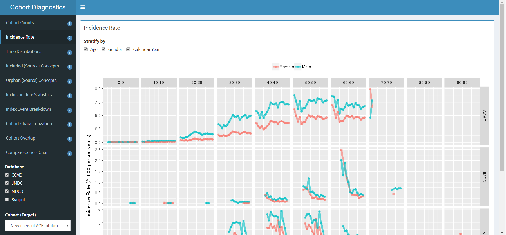{fig-align="center" height="420"}

::: {.source}
Incidence Rate tab, stratified by age, sex, and calendar year. Source: [Viewing results using DiagnosticsExplorer](https://ohdsi.github.io/CohortDiagnostics/articles/ViewingResultsUsingDiagnosticsExplorer.html), CohortDiagnostics documentation.
:::

- Start with **cohort counts**, then **index event breakdown**, then **incidence over time**
- Compare across databases. The same definition should behave similarly in each.

## ATLAS

::: {.columns}
::: {.column width="55%"}
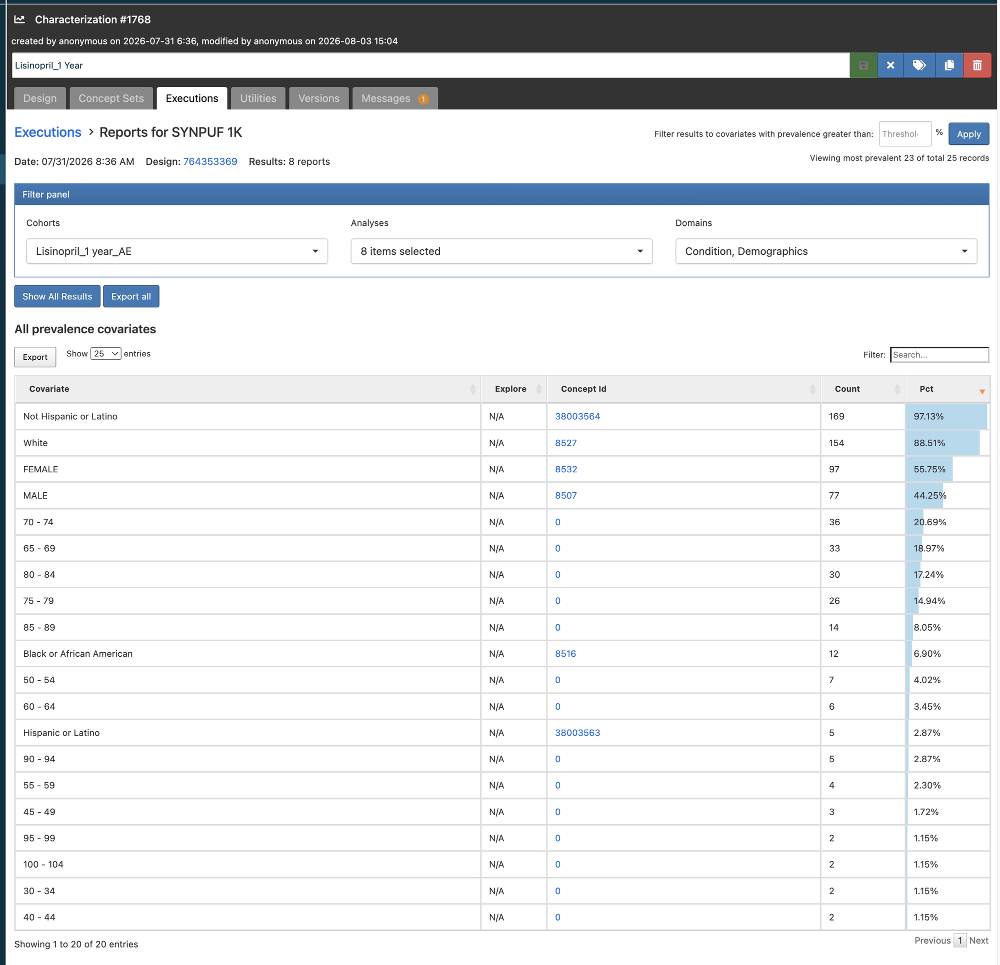{fig-align="center" height="540"}
:::

::: {.column width="45%"}
- ATLAS runs characterizations, incidence, and pathways from the browser
- ATLAS suits exploration. Strategus suits studies that need to be rerun and shared.

::: {.source}
Characterization results in ATLAS: prevalence of demographic covariates for a lisinopril cohort in SynPUF 1K.
:::
:::
:::

## Strengths and Limits of Viewers

| Good at | Less good at |
|---|---|
| Checking cohorts and data | Presenting a single narrative |
| Browsing many results quickly | Figures for a paper or a talk |
| Comparing databases | Emphasizing one finding |

. . .

Papers and talks need custom figures.

# Visualization

## Graphical Excellence

::: {.columns}
::: {.column width="40%"}

:::

::: {.column width="60%"}
> "Graphical excellence is the well-designed presentation of interesting data—a matter of substance, of statistics, and of design."

*Edward Tufte, The Visual Display of Quantitative Information, 1983*
:::
:::

## Exploratory and Explanatory Figures

::: {.columns}
::: {.column width="50%"}
### Exploratory

- For **you**
- Understand the data
- Fast, rough, and many
- No polish
:::

::: {.column width="50%"}
### Explanatory

- For **someone else**
- Communicate a result
- Few and careful
- Labels, annotation, and polish
:::
:::

. . .

Both kinds must represent the data accurately.

## Workhorses, Show Ponies, and Unicorns

Kieran Healy describes two kinds of everyday figures:

- **Workhorse:** a simple, accurate graph that shows the main features of the data
- **Show pony:** a workhorse polished for an audience

. . .

> "Mostly, examples of the latter are just carefully cleaned and brushed versions of the former."

*Kieran Healy, [Data Visualization: A Practical Introduction](https://socviz.co/08-polishing.html), chapter 8*

. . .

A third kind, the **unicorn**, is a one-off creation such as Minard's map of Napoleon's march. Unicorns are hard to produce, and everyday work does not need them.

## A Unicorn: Minard's Map of Napoleon's March

{fig-align="center" height="480"}

::: {.source}
Charles Minard, Napoleon's March on Moscow (1869). Public domain.
:::

## ggplot2

::: {.columns}
::: {.column width="30%"}
{fig-align="center" height="300"}
:::

::: {.column width="70%"}
- An R package for making figures from data
- Based on the grammar of graphics (Wilkinson, 2005) and written by Hadley Wickham
- A figure is built from layers, added one at a time with `+`
- Every figure in this talk was made with ggplot2
:::
:::

## The Grammar of Graphics

`ggplot2` builds figures from components:

| Component | Meaning | Example |
|---|---|---|
| **Data** | The table you plot | Incidence by age and sex |
| **Aesthetics** | Mapping of variables to visual properties | x = age group, y = rate, color = sex |
| **Geoms** | The marks | Points, lines, bars |
| **Facets** | Small multiples | One panel per drug |
| **Scales and theme** | Axes, colors, and styling | Per 1,000 person-years; `theme_minimal()` |

## Eunomia

- A small **synthetic** OMOP database with 2,694 people
- Built for testing and teaching OHDSI tools
- Cohorts: **celecoxib** users (1,844), **diclofenac** users (850), and **GI bleed** (479)

. . .

The data are synthetic. The example figures come from FeatureExtraction and CohortIncidence run on Eunomia, so they show real HADES package output.


## The Example Data: `ir`

`ir` holds GI bleed incidence rates from CohortIncidence run on Eunomia. It has one row per cohort, sex, and age group, for 16 rows in all.

```r
ir <- data_read("data/characterization/incidence_age_sex.csv")
```

| cohort | sex | age_group | ir_per_1000py |
|---|---|---|---:|
| Celecoxib | Female | 30-34 | 179.1 |
| Celecoxib | Male | 30-34 | 227.3 |
| Celecoxib | Female | 35-39 | 272.4 |
| Celecoxib | Male | 35-39 | 232.7 |
| ... | ... | ... | ... |
| Diclofenac | Male | 45-49 | 415.7 |

`ir_per_1000py` is GI bleeds per 1,000 person-years in the year after drug start.

## Step 1: Data and Aesthetics

```r
p <- ggplot(ir, aes(x = age_group, y = ir_per_1000py))
```

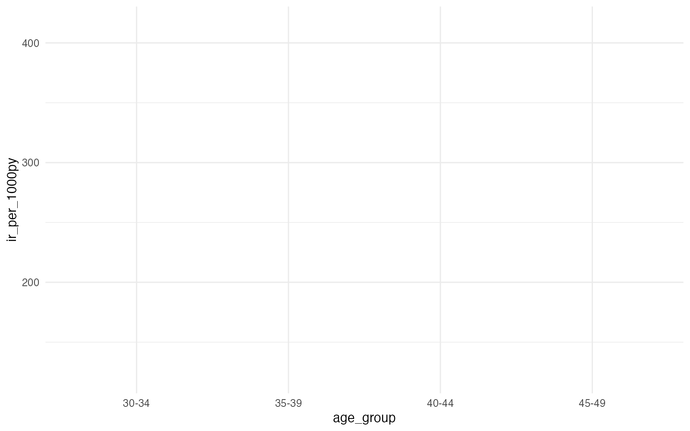{fig-align="center" height="440"}


## Step 2: Add a Geom

```r
p <- p + geom_point()
```

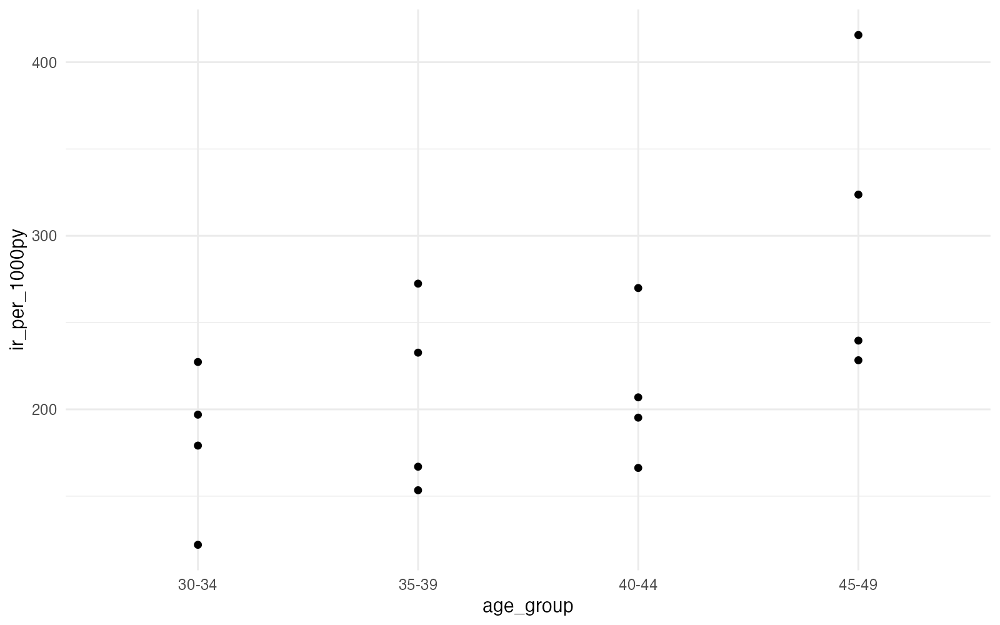{fig-align="center" height="440"}

## Step 3: Add Color and Facets

```r
p <- p + aes(color = sex, group = sex) + geom_line() + facet_wrap(~cohort)
```

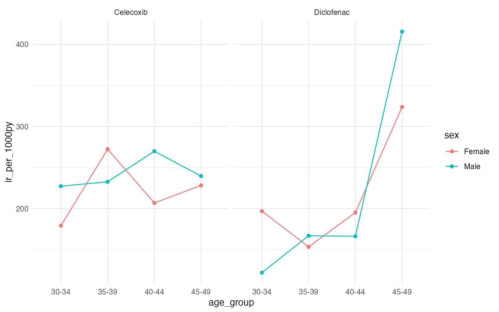{fig-align="center" height="440"}

## Step 4: Add Labels and a Theme

```r
p +
  scale_color_manual(values = c(
    Female = jhu_colors$Purple,
    Male = jhu_colors$BlueLight
  )) +
  labs(
    title = "GI bleed incidence by age and sex",
    x = "Age at drug start",
    y = "Per 1,000 person-years",
    color = NULL
  ) +
  expand_limits(y = 0) +
  theme_jhu()
```

## Step 4: Result

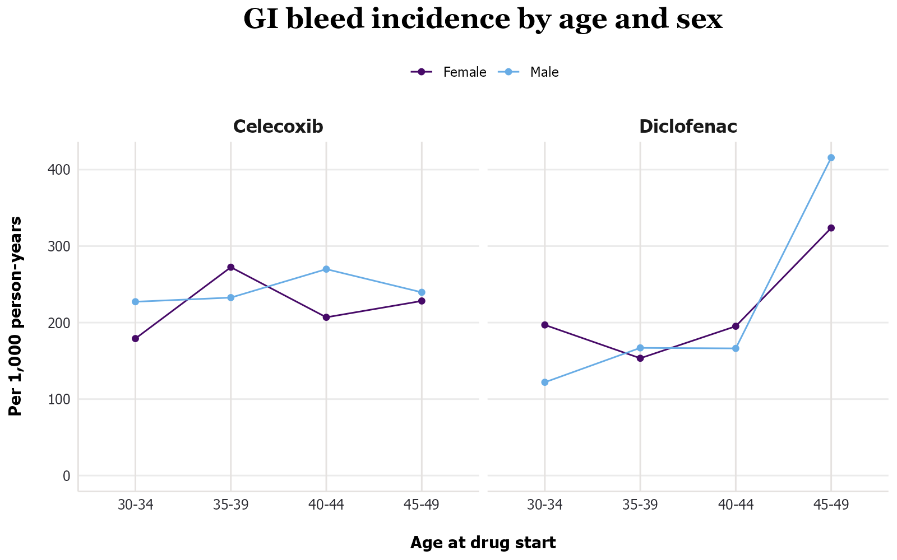{fig-align="center" height="540"}

# Visualization Principles

## Principle 1: Use a Common Scale

{fig-align="center" height="520"}

People judge **position along a common scale** more accurately than angle, area, or color.

## Principle 2: Start Bars at Zero

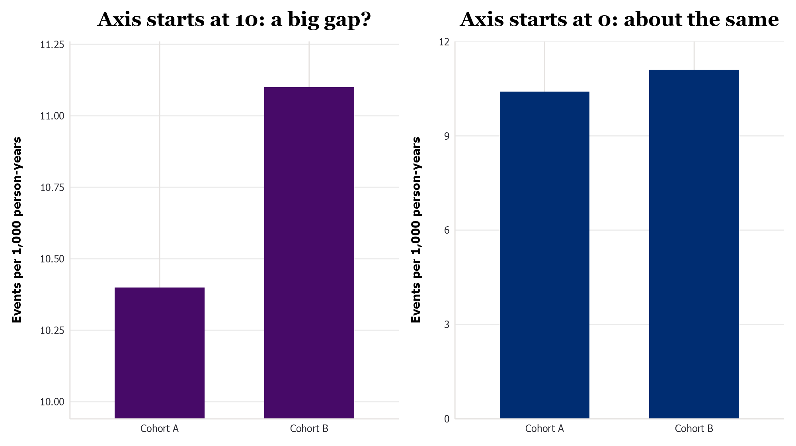{fig-align="center" height="520"}

Bars encode values as **length**, so the axis should typically start at 0.  Dot plots work better when you have
good reason not to start 0 (e.g., comparing means across groups).

## Principle 3: Order Categories Meaningfully

{fig-align="center" height="520"}

Sort categories by value unless they have a natural order, such as age groups or calendar years.

## Principle 4: Label Directly

{fig-align="center" height="520"}

Labels next to the data remove the need to match colors against a legend.

## Principle 5: Use Small Multiples

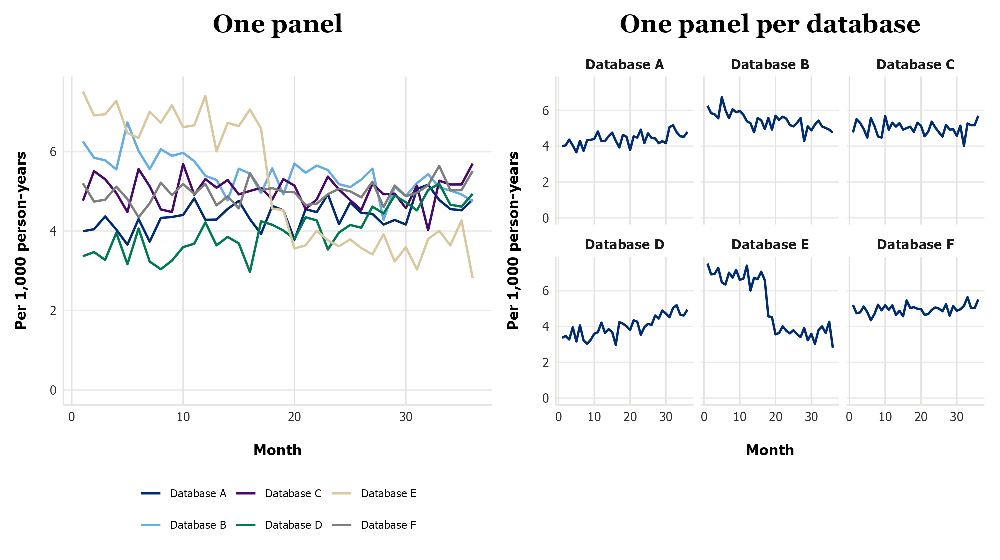{fig-align="center" height="520"}

Separate panels on a common scale often make each series readable. The drop in Database E is easier to see in its own panel.

## Principle 6: Use Color to Highlight

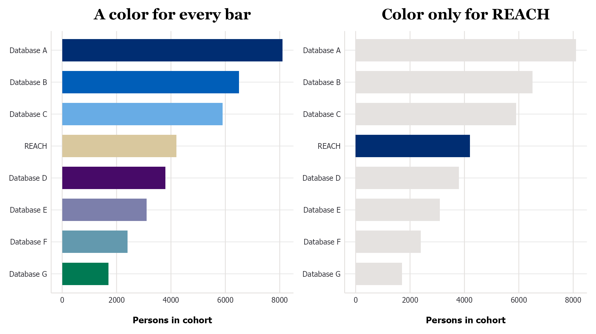{fig-align="center" height="520"}

Color draws the eye. Use it for the comparison that matters and leave the rest gray.
x
## Principle 7: State the Finding in the Title

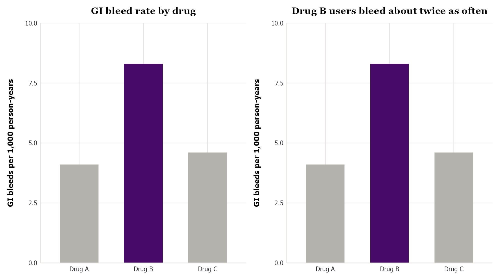{fig-align="center" height="520"}

A title that states the result tells the reader what to look for. Exploratory figures can keep topic titles.

# Examples

## Cohort Sizes: Workhorse

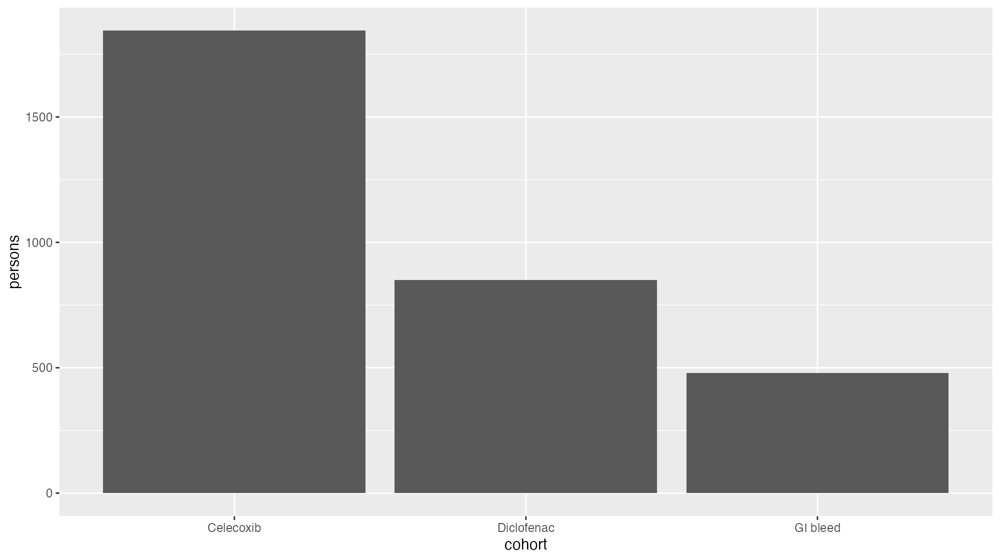{fig-align="center" height="520"}

## Cohort Sizes: Show Pony

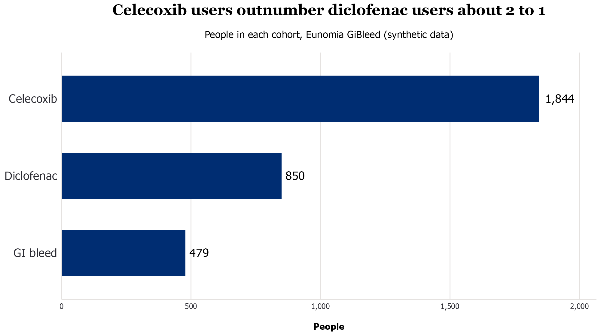{fig-align="center" height="520"}


## Incidence: Default Settings

```r
ggplot(ir, aes(x = age_group_name, y = ir_per_1000py, fill = paste(cohort, sex))) +
  geom_col(position = "dodge")
```

## Incidence: Default Settings Result

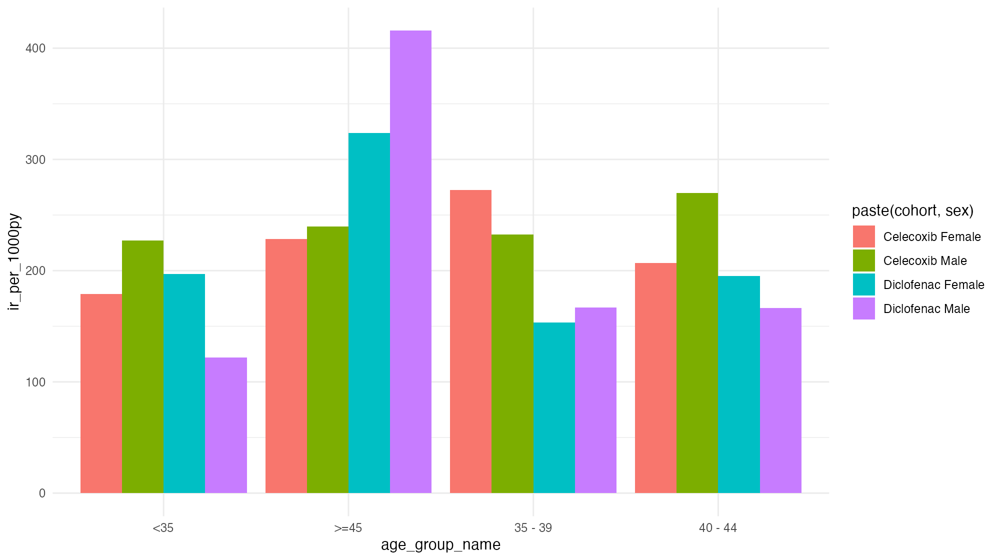{fig-align="center" height="480"}

. . .

This isn't good enough, even for a workhorse. The age groups are not in order and the colors make it hard to parse.

## Incidence: Workhorse

```r
p <- ggplot(ir, aes(x = age_group, y = ir_per_1000py, color = cohort)) +
  geom_line(aes(group = cohort)) +
  geom_point() +
  facet_wrap(~sex) +
  expand_limits(y = 0)
```

## Incidence: Workhorse Result

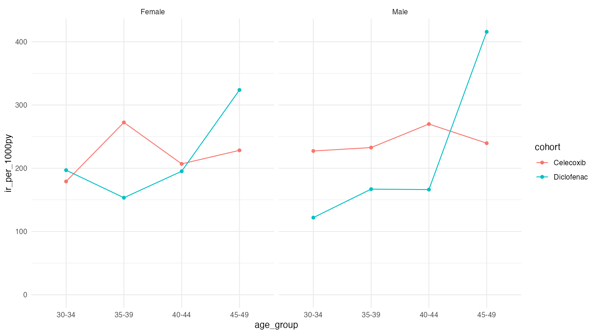{fig-align="center" height="480"}

`age_group` is a factor in age order. Each sex has its own panel, and the y axis starts at zero.

## Incidence: Show Pony

```r
p +
  geom_text(
    data = \(d) filter(d, age_group == "45-49"),
    aes(label = cohort),
    hjust = -0.25
  ) +
  scale_color_manual(
    values = drug_colors,
    guide = "none"
  ) +
  scale_x_discrete(
    expand = expansion(add = c(0.4, 1.3))
  ) +
  labs(
    title = "Celecoxib users bled more ...",
    subtitle = "GI bleeds per 1,000 ...",
    x = "Age at drug start",
    y = "GI bleeds per 1,000 person-years"
  ) +
  theme_jhu()
```

## Incidence: Show Pony Result

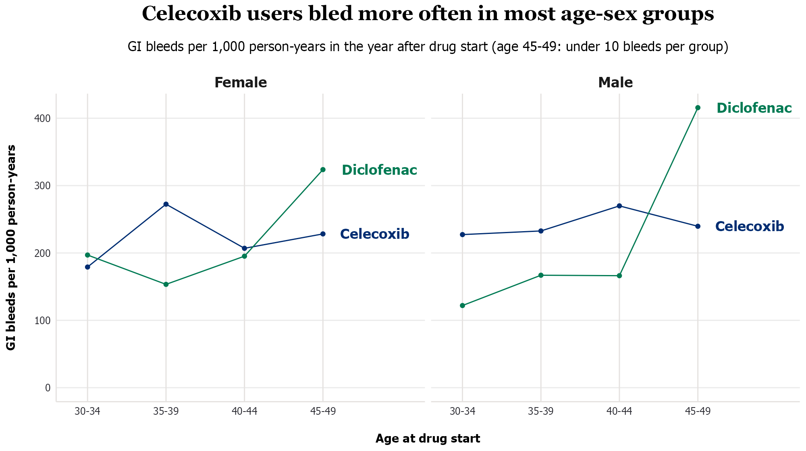{fig-align="center" height="540"}

Improved: one panel per sex, lines on a common scale starting at 0, direct labels, and a title that states the finding.
Overall: celecoxib 239.7 vs diclofenac 173.4 GI bleeds per 1,000 person-years. Age 45-49 groups have under 10 bleeds each, so don't read much into the jump.
:::

## Table 1

::: {style="font-size: 0.55em;"}
| In the year before starting | Celecoxib (%) | Diclofenac (%) | SMD |
|---|---:|---:|---:|
| Female | 50.4 | 52.1 | -0.03 |
| Age 35-39 | 48.0 | 49.4 | -0.03 |
| Age 40-44 | 36.7 | 35.8 | 0.02 |
| Polyp of colon | 17.1 | 7.5 | **0.30** |
| Esophagitis | 10.0 | 4.4 | **0.22** |
| Ulcerative colitis | 3.1 | 1.1 | **0.14** |
| Acute viral pharyngitis | 7.5 | 4.8 | **0.11** |
| Sinusitis | 12.1 | 13.5 | -0.04 |
| Acetaminophen | 7.4 | 7.2 | 0.01 |
| Ibuprofen | 1.1 | 1.8 | -0.05 |
:::

**Standardized mean difference (SMD):** the difference between groups on a feature, in standard deviation units. An absolute SMD above 0.1 is a common threshold for imbalance.

## Table 1 as a Figure

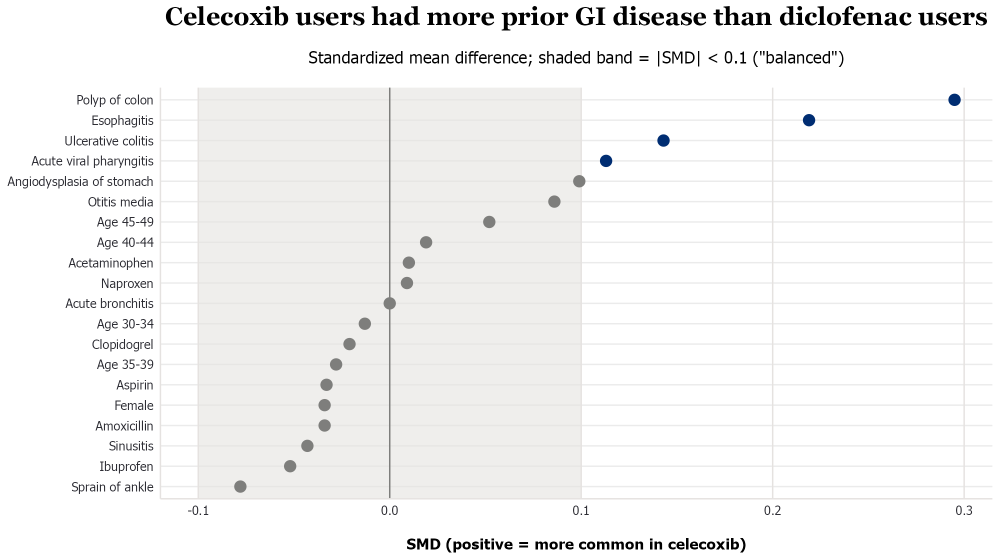{fig-align="center" height="480"}

Data in a table are often easier to parse visually as a figure.

:::

## Age and Sex: Experimenting To Find The Best View

`age_sex` holds the share of each cohort in each age group and sex at drug start. It comes from a query of the Eunomia cohort and person tables.

The next four slides plot the same table in four ways:

1. Stacked bars
2. Pyramid
3. Facets
4. Connected dot plot

The data are the same in every version. Only the geoms and facets change.

Think about which you one you think works best.

## Age and Sex: Stacked Bars


```r
ggplot(age_sex, aes(x = age, y = pct, fill = sex)) + geom_col() + facet_wrap(~cohort)
```

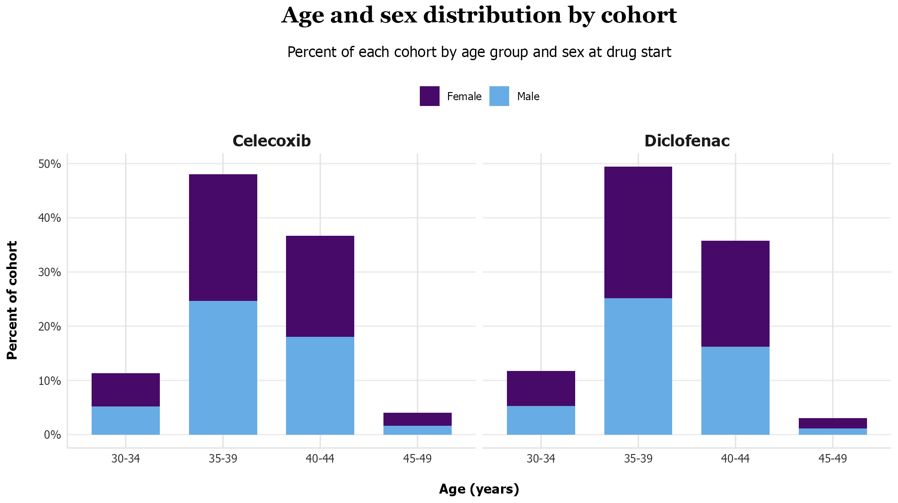{fig-align="center" height="520"}

<!-- Caption, hidden for now: The age distribution is clear. Women and men are hard to compare because only the lower segment starts at zero. -->

## Age and Sex: Pyramid

```r
# women's values made negative so their bars point left
ggplot(age_sex, aes(x = pct_signed, y = age, fill = sex)) + geom_col() + facet_wrap(~cohort)
```

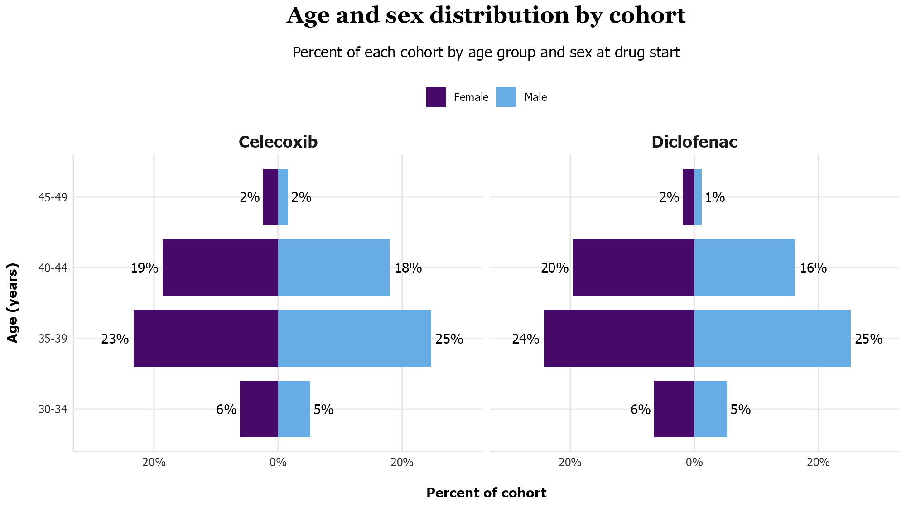{fig-align="center" height="490"}

<!-- Caption, hidden for now: Each sex has its own baseline, so both are easy to read. Comparing a pair still means judging two lengths in opposite directions. -->

## Age and Sex: Facets

```r
ggplot(age_sex, aes(x = pct, y = age, fill = sex)) + geom_col() + facet_grid(sex ~ cohort)
```

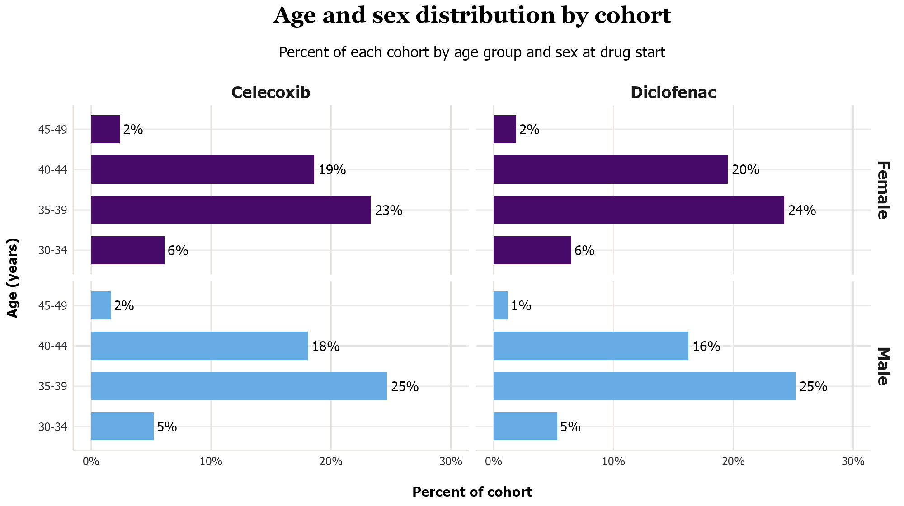{fig-align="center" height="520"}

<!-- Caption, hidden for now: Comparing women and men means looking between panels. -->

## Age and Sex: Connected Dot Plot

```r
ggplot(age_sex, aes(x = pct, y = age)) +
  geom_line(aes(group = age)) + geom_point(aes(color = sex)) + facet_wrap(~cohort)
```

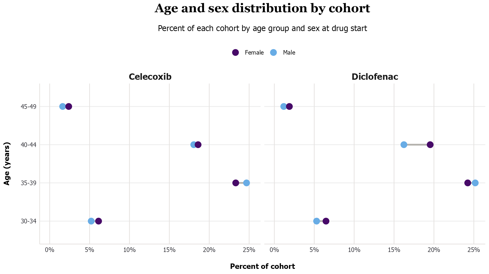{fig-align="center" height="490"}

<!-- Caption, hidden for now: Women and men share one scale in each row, so the gap between them is the line. -->

## Time to GI Bleed: Four Views

`tte` has one row per person with a GI bleed and the number of days from drug start to the bleed. There are 355 people in the celecoxib cohort and 124 in the diclofenac cohort.

- `tte_weekly` counts the bleeds in each week after drug start.
- `tte_cum` adds each person's cumulative percent of their cohort's bleeds.

The next four slides plot these data in four ways:

1. Histogram
2. Weekly lines on one panel
3. Weekly lines with facets
4. Cumulative lines

## Time to GI Bleed: Histogram

```r
ggplot(tte, aes(x = daysToEvent, fill = cohort)) +
  geom_histogram(binwidth = 7, boundary = 0, closed = "left") + facet_wrap(~cohort, ncol = 1)
```

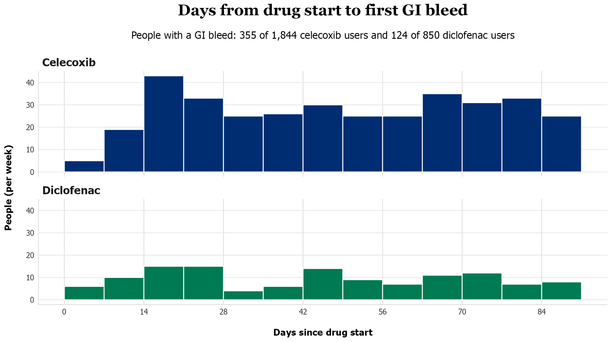{fig-align="center" height="490"}

Full script: scripts/characterization/06-figure-time-to-event.R
:::

## Time to GI Bleed: Weekly Lines

```r
ggplot(tte_weekly, aes(x = week_start, y = n, color = cohort)) + geom_line() + geom_point()
```

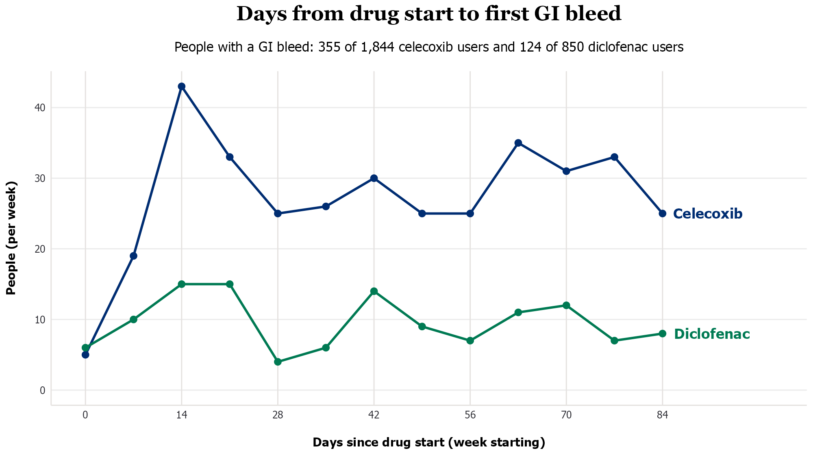{fig-align="center" height="520"}

## Time to GI Bleed: Weekly Lines With Facets

```r
ggplot(tte_weekly, aes(x = week_start, y = n, color = cohort)) + geom_line() + geom_point() +
  facet_wrap(~cohort, ncol = 1)
```

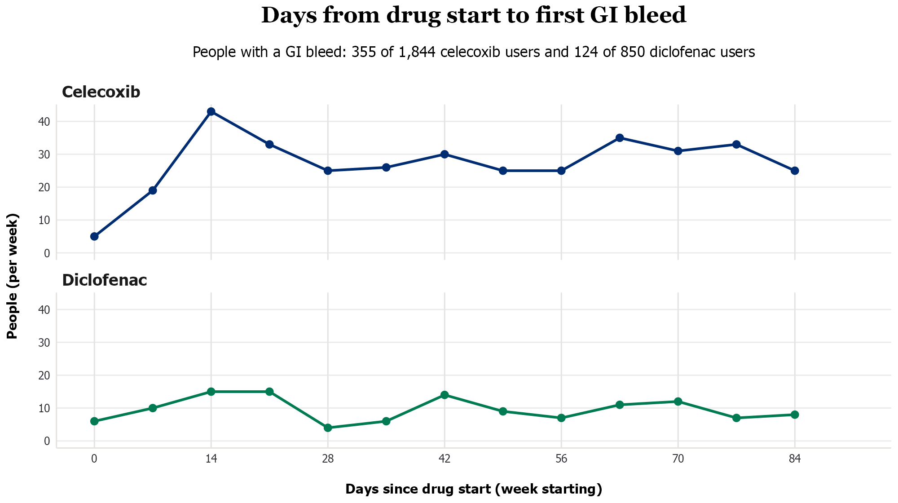{fig-align="center" height="490"}

## Time to GI Bleed: Cumulative Lines

```r
ggplot(tte_cum, aes(x = daysToEvent, y = pct, color = cohort)) + geom_step()
```

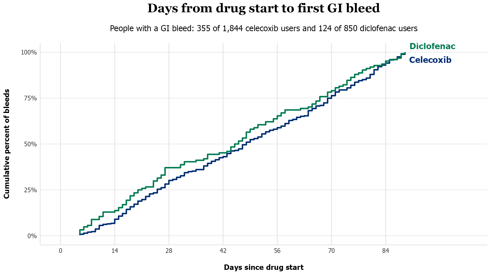{fig-align="center" height="520"}

# Wrap-Up

## Summary

1. **Characterization** describes populations and makes no causal claims. It is a study type on its own and the first step of every study.
2. **Viewers** are for checking cohorts and data. Custom figures are for presenting findings.
3. **Good figures** follow good principles (e.g., common scale and honest axes) to make easy-to-understand figures that concisely convey the desired messge.

## Resources

- [The Book of OHDSI](https://ohdsi.github.io/TheBookOfOhdsi/)
- [HADES packages](https://ohdsi.github.io/Hades/)
- [Strategus](https://ohdsi.github.io/Strategus/)
- [results.ohdsi.org](https://results.ohdsi.org/)
- Kieran Healy, [*Data Visualization: A Practical Introduction*](https://socviz.co/)

## Questions?
