```{r}
#| label: setup
#| include: false

library(framework)
scaffold()
```

# Welcome

## About Me

- Data scientist, Johns Hopkins Biostatistics Center, Department of Biostatistics
- Trained in the social sciences; 10+ years as a data scientist and software developer
- I teach data visualization and help run clinical and observational studies
- ewestlund@jhu.edu

## Today's Plan

1. What is good data visualization?
2. Workhorses, show ponies, and unicorns
3. Visualization principles
4. Examples

. . .

No programming background is assumed. The examples use R's `ggplot2`, but the ideas apply to any tool.

# Graphical Excellence

## Graphical Excellence

::: {.columns}
::: {.column width="40%"}

:::

::: {.column width="60%"}
> "Graphical excellence is the well-designed presentation of interesting data—a matter of **substance**, of **statistics**, and of **design**."

*Edward Tufte, The Visual Display of Quantitative Information, 1983*
:::
:::

## Dense

::: {.columns}
::: {.column width="40%"}

:::

::: {.column width="60%"}
> "It is that which gives to the viewer the greatest number of ideas in the shortest time with the least ink in the smallest space."

*Edward Tufte, The Visual Display of Quantitative Information, 1983*
:::
:::

## Multivariate

::: {.columns}
::: {.column width="40%"}

:::

::: {.column width="60%"}
> "It is nearly always multivariate."

*Edward Tufte, The Visual Display of Quantitative Information, 1983*
:::
:::

## Truthful

::: {.columns}
::: {.column width="40%"}

:::

::: {.column width="60%"}
> "Graphical excellence requires telling the truth about the data."

*Edward Tufte, The Visual Display of Quantitative Information, 1983*
:::
:::

# Workhorses, Show Ponies, and Unicorns

## Workhorses and Show Ponies

Kieran Healy describes two kinds of everyday figures:

- **Workhorse:** a simple, accurate graph that shows the main features of the data
- **Show pony:** a workhorse polished for an audience

. . .

> "Mostly, examples of the latter are just carefully cleaned and brushed versions of the former."

*Kieran Healy, [Data Visualization: A Practical Introduction](https://socviz.co/08-polishing.html), chapter 8*

## Unicorns

A third kind, the **unicorn**, is a one-off creation such as Minard's map of Napoleon's march.

Unicorns are hard to produce, and everyday work does not need them.

## A Unicorn: Minard's Map of Napoleon's March

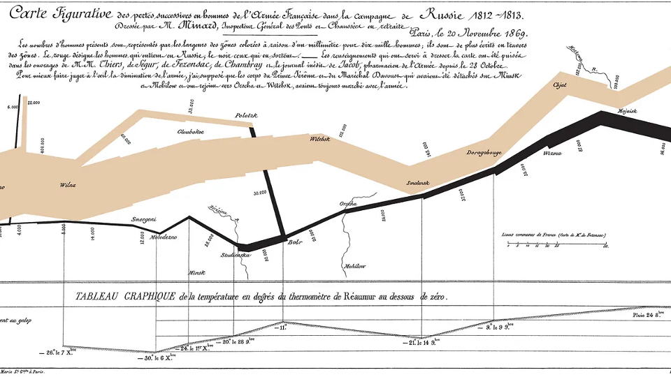{fig-align="center" height="480"}

::: {.source}
Charles Minard, Napoleon's March on Moscow (1869). Public domain.
:::

## Reading Minard's Map

The map shows six variables at once:

- The width of the band is the size of the army
- The band's position gives latitude and longitude
- Tan is the advance and black is the retreat
- The chart at the bottom shows the temperature and dates on the retreat

. . .

The army set out with about 422,000 men. About 10,000 returned.

## Achieving Graphical Excellence

> "[Minard's classic image] can be described and admired, but there are no compositional principles on how to create that one wonder graphic in a million."

*Edward Tufte, The Visual Display of Quantitative Information, 1983*

## Recreating Minard with Matplotlib

Someone has done a pretty impressive job recreating this visualization using Python's matplotlib library. It starts with Minard's data:

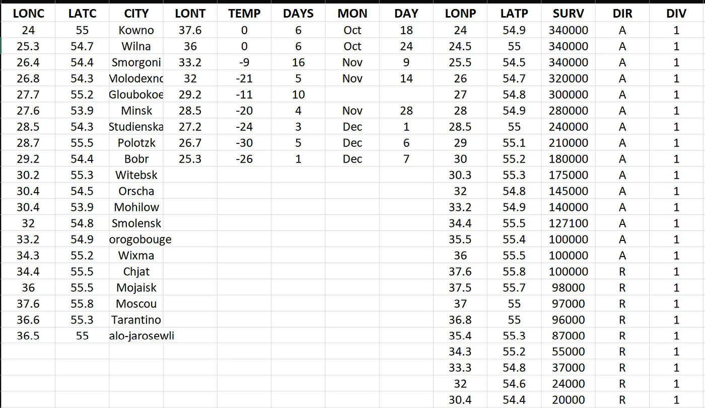{fig-align="center" height="350"}

::: {.source}
[View the full tutorial](https://amitamola.medium.com/minards-chart-using-matplotlib-in-python-fbe8865cad78)
:::

## Recreating Minard with Matplotlib (cont.)

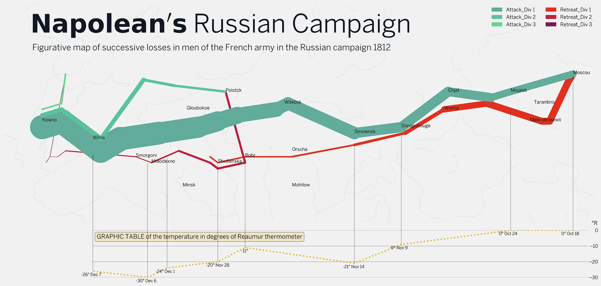{fig-align="center" height="500"}

::: {.source}
Source: Amola, A. (2024). "Minard's Chart Using Matplotlib in Python." Medium.
:::

## For the Rest of Us

Tufte's examples are extraordinary, but most of our work is more routine. Tufte suggests:

- Choose the right format for the question.
- Use words, numbers, and drawing together.
- Show enough complexity to be useful.
- Avoid decoration that does not help the argument.

# Exploratory and Explanatory Figures

## Exploratory and Explanatory Figures

::: {.columns}
::: {.column width="50%"}
### Exploratory

- For **you**
- Understand the data
- Fast, rough, and many
- No polish
:::

::: {.column width="50%"}
### Explanatory

- For **someone else**
- Communicate a result
- Few and careful
- Labels, annotation, and polish
:::
:::

. . .

Both kinds must represent the data accurately.

## Exploratory Work and Workhorses

- Exploratory work is mostly done with workhorses. They are quick to make, and default settings are usually fine.
- Explanatory work calls for show ponies. A show pony usually starts as the workhorse that showed you the result.

## Visualization As An Analytic Tool

Visualization is a crucial part of understanding data from the start of an analysis. It shows:

- structure
- variation
- patterns
- anomalies
- relationships

## These Goals Overlap

- Understanding and communication are not completely separable.
- The same figure can help us discover a pattern, refine our thinking, and explain the result to someone else.
- A workhorse may go straight into a supplement or a lab meeting.
- Journals often redraw figures, so a clean workhorse may be all a manuscript needs.

## Visualization Is Iterative

Good visualization usually moves in cycles:

1. Ask a question
2. Prepare the data
3. Make a plot
4. Interpret what we see
5. Revise the plot
6. Share or revise the result for an audience

# Visualization Principles

## Principle 1: Use a Common Scale

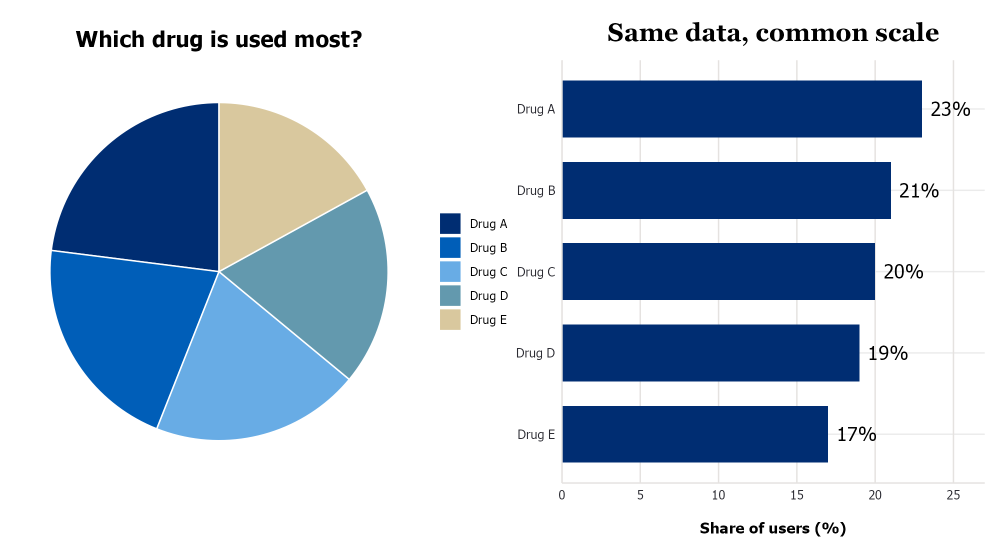{fig-align="center" height="400"}

People judge **position along a common scale** more accurately than angle, area, or color.

## Principle 2: Start Bars at Zero

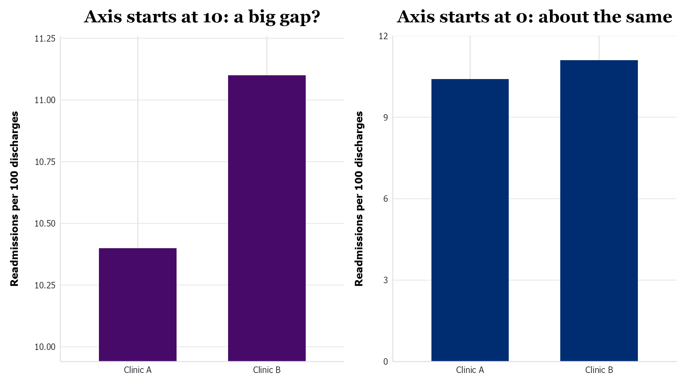{fig-align="center" height="400"}

Bars encode values as **length**, so the axis should typically start at 0. Dot plots work better when you have good reason not to start at 0 (e.g., comparing means across groups).

## Principle 3: Order Categories Meaningfully

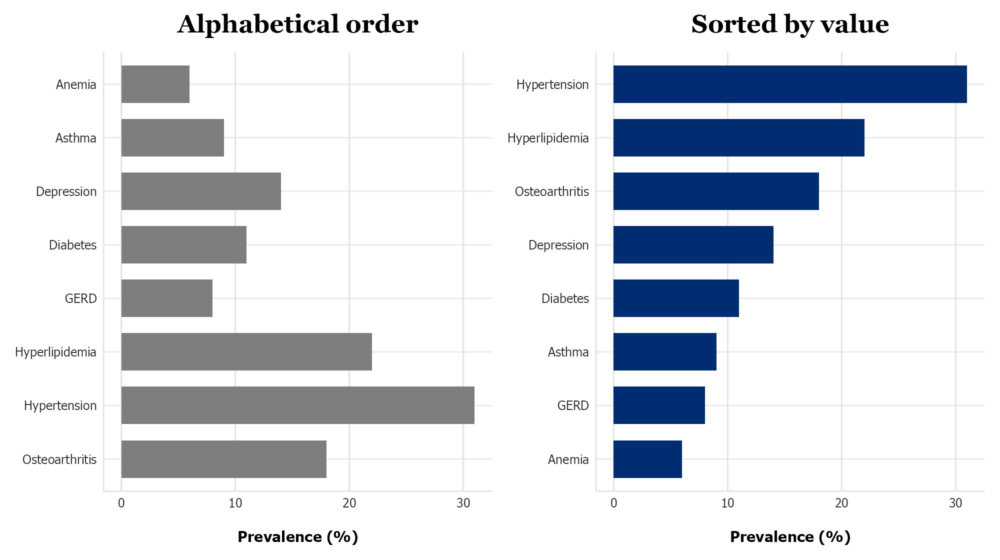{fig-align="center" height="400"}

Sort categories by value unless they have a natural order, such as age groups or calendar years.

## Principle 4: Label Directly

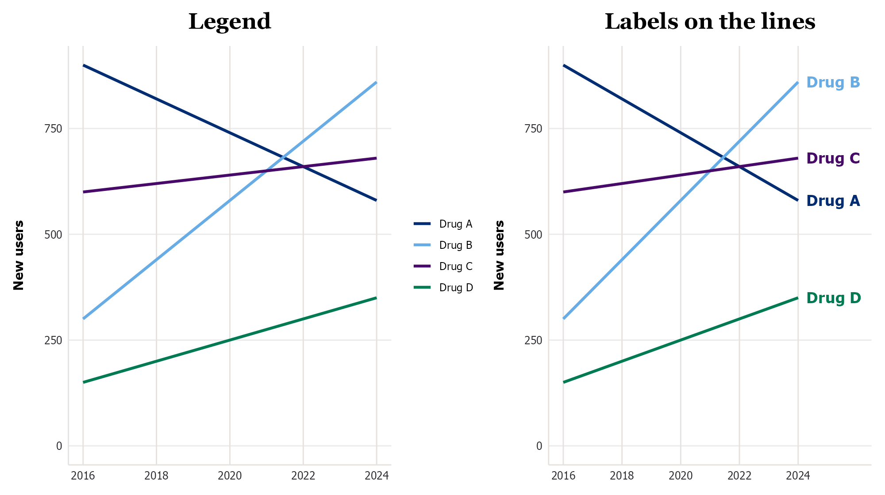{fig-align="center" height="400"}

Labels next to the data remove the need to match colors against a legend.

## Principle 5: Use Small Multiples

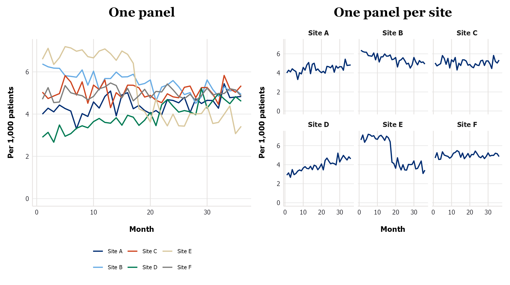{fig-align="center" height="400"}

Separate panels on a common scale often make each series readable. The drop in Site E is easier to see in its own panel.

## Principle 6: Use Color to Highlight

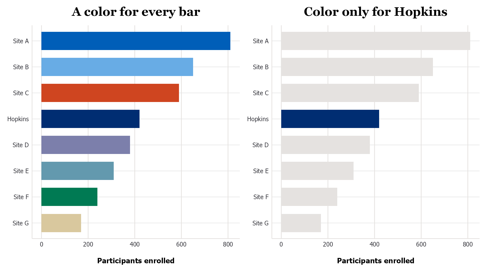{fig-align="center" height="400"}

Color draws the eye. Use it for the comparison that matters and leave the rest gray.

## Principle 7: State the Finding in the Title

{fig-align="center" height="400"}

A title that states the result tells the reader what to look for. Exploratory figures can keep topic titles.

## A Note on Finding Titles

Finding titles work best in talks, posters, reports, and public communication.

They are often a poor fit for manuscripts:

- Most journals do not want a title inside the figure. The result goes in the caption.
- Reviewers may read a declarative title as overclaiming.

. . .

The title should match the strength of the evidence. Write "is associated with" when the design does not support "causes."

# Examples

## Core Visualization Questions

- **Counts:** how many are in each category?
- **Rank:** what is higher or lower?
- **Center:** what is typical?
- **Spread:** how much variation is there?
- **Shape:** what does the distribution look like?
- **Outliers and anomalies:** what is unusual?

## Core Visualization Questions (cont.)

- **Composition:** what is the whole made of?
- **Grouping:** how do patterns differ across categories?
- **Association:** how do variables move together?
- **Change:** how do patterns move over time or order?
- **Space:** where do patterns occur?
- **Flow:** how do entities, such as people or decisions, move through stages?

. . .

Each example below starts with the question it answers.

## ggplot2

::: {.columns}
::: {.column width="30%"}
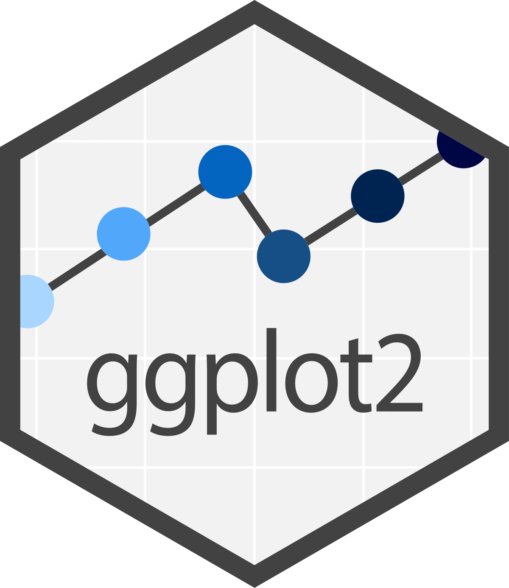{fig-align="center" height="300"}
:::

::: {.column width="70%"}
- An R package for making figures from data
- Based on the grammar of graphics (Wilkinson, 2005) and written by Hadley Wickham
- A figure is built from layers, added one at a time with `+`
- Every figure in this talk was made with ggplot2
:::
:::

## The Grammar of Graphics

`ggplot2` builds figures from components:

| Component | Meaning | Example |
|---|---|---|
| **Data** | The table you plot | One row per survey participant |
| **Aesthetics** | Mapping of variables to visual properties | x = age group, y = blood pressure |
| **Geoms** | The marks | Bars, boxes, violins, points, lines |
| **Facets** | Small multiples | One panel per group |
| **Scales and theme** | Axes, colors, and styling | Log scale; `theme_minimal()` |

## The Data

**NHANES 2021–2023** is a national survey of U.S. adults and children with interviews, physical exams, and lab tests.

- **Systolic blood pressure** for about 6,100 adults
- **Daily energy intake** (calories) from dietary recalls for about 10,700 people of all ages

::: {.source}
Simplified public-use files from CDC/NCHS. Survey weights are not applied, so these figures describe the sample and are not national estimates.
:::

## Workhorses: Distributions

For continuous variables, we usually describe:

- **Center:** what is typical (mean, median)?
- **Spread:** how much variation is there (range, IQR, standard deviation)?
- **Shape:** skew, tails, gaps, peaks, heaping, and multiple modes
- **Unusual values:** what stands out?

. . .

Summary statistics compress these into a few numbers. Plots show what the summaries hide. The next three workhorses are the standard tools for this job.

## Histograms

**Question:** what is the center, spread, and shape of one continuous variable?

- A histogram counts how many values fall into each bin along one measurement scale.
- It shows skew, tails, gaps, and multiple peaks that a mean and standard deviation do not.
- The bin width changes what you can see.

## Histogram: Systolic Blood Pressure

```r
ggplot(adult_bp, aes(x = systolic_mean)) +
  geom_histogram(binwidth = 5)
```

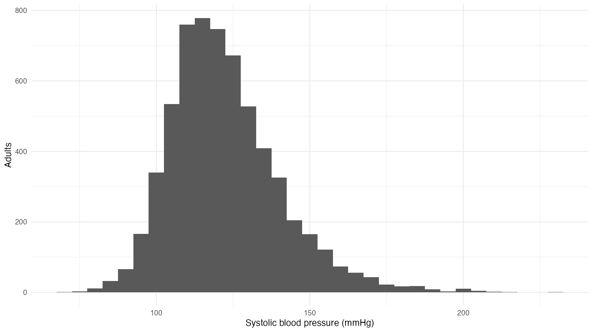{fig-align="center" height="350"}

The distribution is centered a little above 115 mmHg and has a long right tail of high readings.

## Histogram: Bin Width

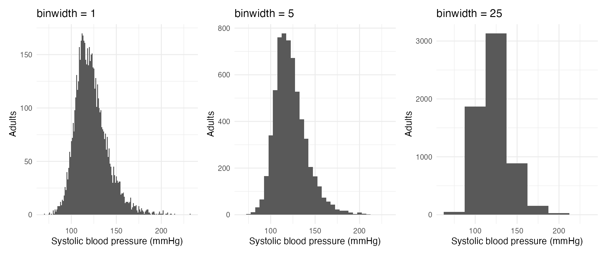{fig-align="center" height="400"}

Small bins show more local detail, including the rounding in the readings. Large bins smooth over the shape. Neither is automatically correct, so try a few.

## Box Plots

**Question:** how do the center and spread of a variable compare across groups, and which values are unusual?

A box plot is a compact summary of a distribution. It shows:

- the median
- the middle 50% of values (the box)
- the overall reach of typical values (the whiskers)
- points that are unusual by the 1.5 × IQR rule

Box plots are well suited to comparing many groups side by side.

## Box Plot: Energy Intake by Age

```r
ggplot(diet, aes(x = age_group, y = mean_daily_energy_kcal)) +
  geom_boxplot()
```

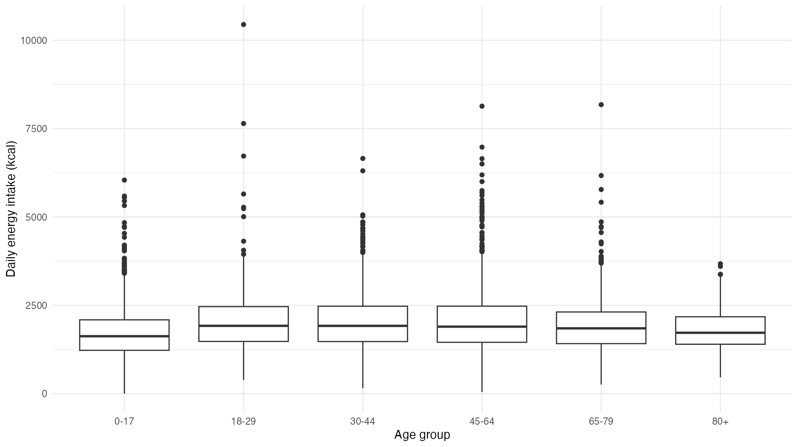{fig-align="center" height="350"}

Adult medians are similar, and children's median is lower. Every group has a long upper tail, and one person reports over 10,000 kcal per day.

## Box Plot With the Data

```r
  geom_jitter(width = 0.2, alpha = 0.15) +
  geom_boxplot(outlier.shape = NA, fill = NA)
```

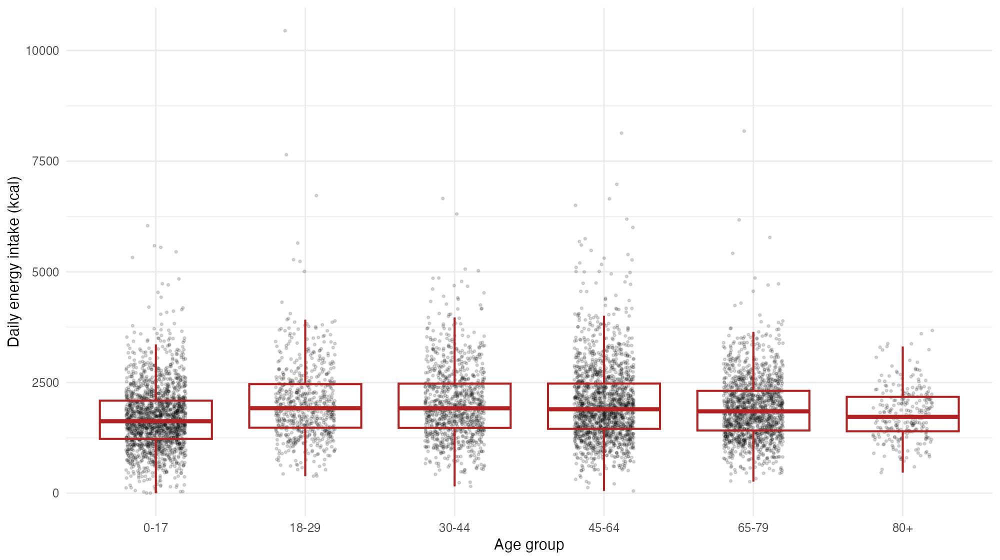{fig-align="center" height="350"}

A box plot does not show how many observations are in each group. The points show that there are far fewer adults 80 and older.

## Violin Plots

**Question:** how does the shape of a distribution differ across groups?

- A violin plot uses smoothing to show where values are concentrated in each group.
- It shows wide and narrow parts of the distribution, skew, and multiple peaks that a box plot can hide.
- It is still a smoothed display, so small bumps should not be overinterpreted.

## Violin Plot: Energy Intake by Age

```r
ggplot(diet, aes(x = age_group, y = mean_daily_energy_kcal)) +
  geom_violin()
```

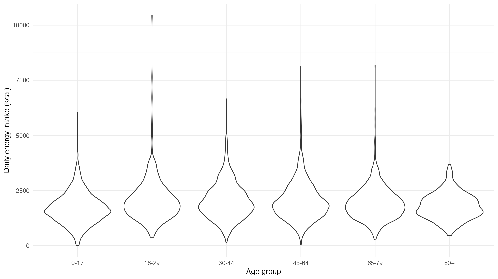{fig-align="center" height="350"}

Each group's values pile up between about 1,000 and 3,000 kcal, with a thin tail above.

## Violin Plot With a Box Plot

```r
  geom_violin(fill = "gray90") +
  geom_boxplot(width = 0.12, outlier.shape = NA)
```

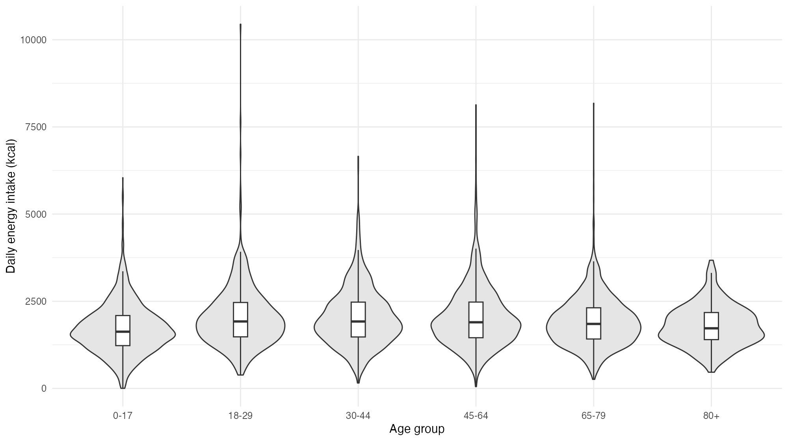{fig-align="center" height="350"}

The violin shows the shape. The box plot layer adds the median and the middle 50% back.

## Histograms, Box Plots, and Violin Plots

| Plot | Use it to see | Limitation |
|---|---|---|
| **Histogram** | Shape, center, and spread of one variable, with counts | Bin width changes what you see |
| **Box plot** | Median, spread, and unusual values across groups | Hides shape and sample size |
| **Violin plot** | Shape across groups | Smoothing can suggest bumps that are not there |

. . .

In ggplot2, switching between them means changing one geom: `geom_histogram()`, `geom_boxplot()`, or `geom_violin()`.

# Show Ponies

## Show Ponies

Each example below starts from a workhorse and keeps its data and geoms. The polish applies the principles:

- A title that states the finding
- Direct labels in place of legends
- Color used to highlight
- Scales and reference lines that match the question
- Sources and caveats in the caption

## Blood Pressure by Age

**Question (grouping):** how does the distribution of blood pressure differ across age groups?

- Grouped box plots put each group's median and spread on one common scale.
- A reference line at a clinical threshold turns the comparison into a share of people above it.

## Blood Pressure by Age: Workhorse

```r
ggplot(adult_bp, aes(x = age_group, y = systolic_mean)) +
  geom_boxplot()
```

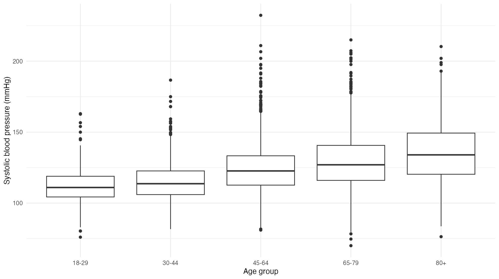{fig-align="center" height="440"}

## Blood Pressure by Age: Show Pony

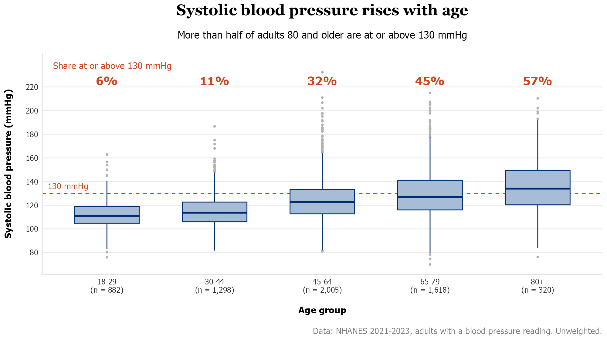{fig-align="center" height="400"}

Added: the 130 mmHg stage 1 hypertension line, the share at or above it in each group, sample sizes, a finding title, and the data source.

## Postpartum Depression and Anxiety

**Question (comparison):** within each state, how do two paired estimates differ?

- A dot plot places both estimates on a common scale. It avoids the extra area of paired bars.
- Connecting each state's two dots makes the pair one object, and the length of the line is the gap.

::: {.source}
CDC PRAMS 2011: percent of new mothers reporting depression or anxiety symptoms after birth.
:::

## Postpartum Depression and Anxiety: Workhorse

```r
ggplot(mental_health_long, aes(x = estimate, y = location, color = measure)) +
  geom_point()
```

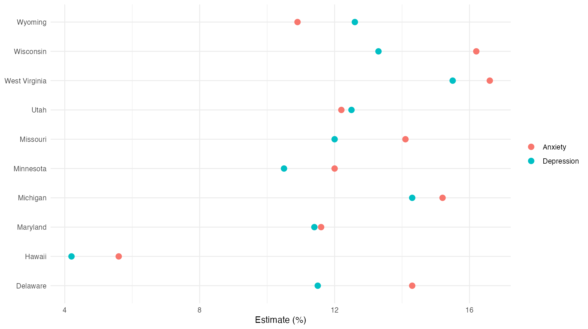{fig-align="center" height="440"}

## Postpartum Depression and Anxiety: Show Pony

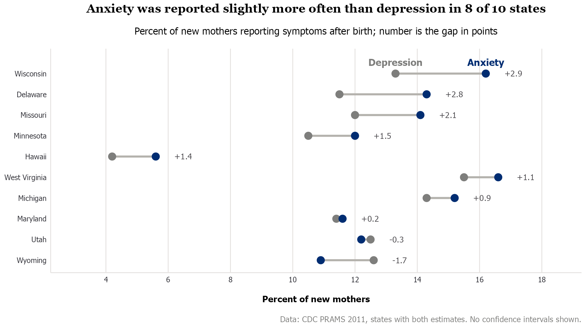{fig-align="center" height="400"}

Added: connecting lines, states sorted by the gap, labels in place of the legend, the gap as a number, and a caption noting that no confidence intervals are shown.

## Income and Infant Mortality

**Question (association):** how do two numeric variables move together?

- A scatterplot shows two numeric variables at once.
- Look for direction, form, strength, spread, unusual points, and groups.
- A log scale helps when one variable is strongly right-skewed, such as income.

::: {.source}
Leinhardt and Wasserman (1979): income and infant mortality for 105 countries, around 1970.
:::

## Income and Infant Mortality: Workhorse

```r
ggplot(infant, aes(x = income_usd_per_capita, y = infant_mortality_per_1000,
                   color = region)) +
  geom_point()
```

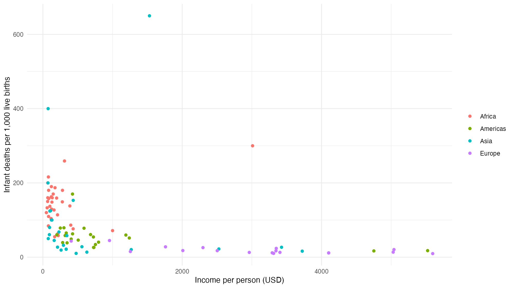{fig-align="center" height="350"}

## Income and Infant Mortality: Show Pony

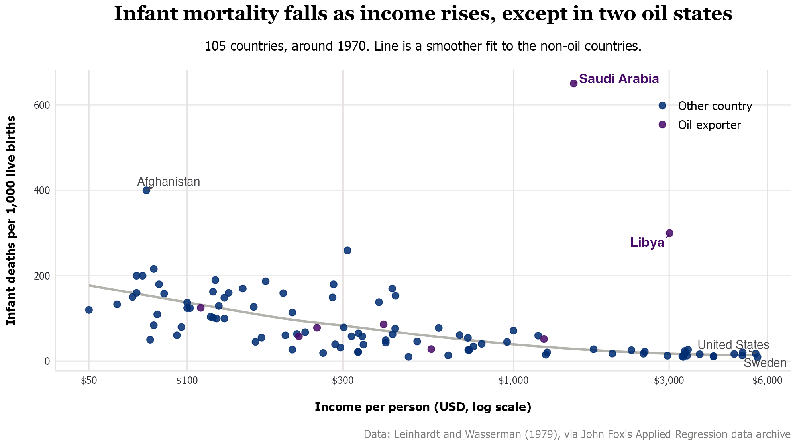{fig-align="center" height="400"}

Added: a log income scale, a smoother for the overall trend, color for oil exporters only, a few labeled countries, and a finding title.

## Flu Vaccination

**Question (change):** how does a value change over time, and does the pattern differ by group?

- Line plots work well when the x axis has a meaningful order, such as flu seasons.
- Use a comparable time point in every season. Here it is coverage by May.

::: {.source}
CDC FluVaxView: share of the U.S. population vaccinated against flu, by age group.
:::

## Flu Vaccination: Workhorse

```r
ggplot(flu_us, aes(x = season_start_year, y = estimate, color = age_group)) +
  geom_line() +
  geom_point()
```

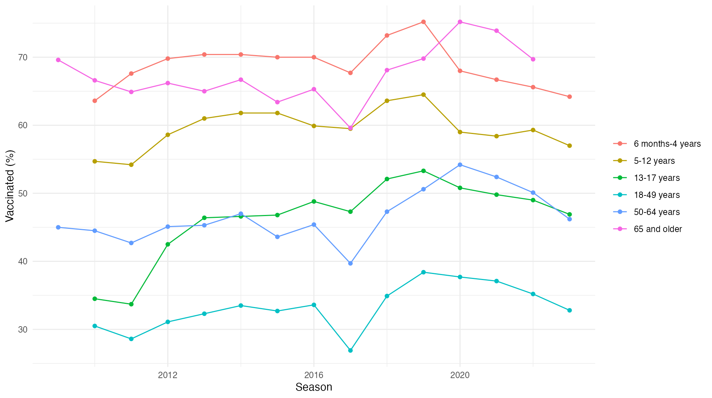{fig-align="center" height="350"}

## Flu Vaccination: Show Pony

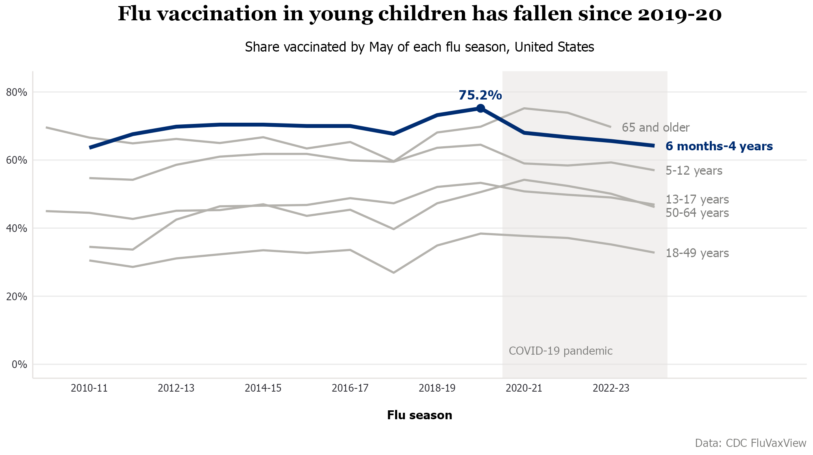{fig-align="center" height="400"}

Added: one age group highlighted with the others in gray, direct labels, the peak value labeled, the pandemic period shaded, and a y axis starting at 0.

# Wrap-Up

## Summary

1. Graphical excellence is a matter of substance, statistics, and design. It requires telling the truth about the data.
2. Most figures are workhorses. The few we share become show ponies. Unicorns are rare.
3. Workhorses support exploratory work, and show ponies support explanatory work. The two overlap.
4. Choose the figure that answers the question. Histograms, box plots, and violin plots each show a different part of a distribution.
5. A handful of principles turn a workhorse into a show pony.

## Data Visualization Checklist

Before you call a figure finished, check:

- **Question:** does the title or caption make the point clear?
- **Data:** is the unit of observation clear?
- **Variables:** are labels and units readable?
- **Scale:** does the axis support the claim honestly?
- **Color:** does color have a job? Is it used effectively?
- **Accessibility:** is the plot readable for all people in all mediums?
- **Destination:** does the format match where it is going?

## Further Reading

::: {.small}
- Tufte, E. (1983). *The Visual Display of Quantitative Information*
- Cleveland, W. S. (1993). *Visualizing Data*
- Healy, K. (2018). [*Data Visualization: A Practical Introduction*](https://socviz.co/)
- Wickham, H. (2016). [*ggplot2: Elegant Graphics for Data Analysis*](https://ggplot2-book.org/)
- Course materials and data: [github.com/erikwestlund/data-visualization-2026](https://github.com/erikwestlund/data-visualization-2026)
:::

## Questions?

ewestlund@jhu.edu
